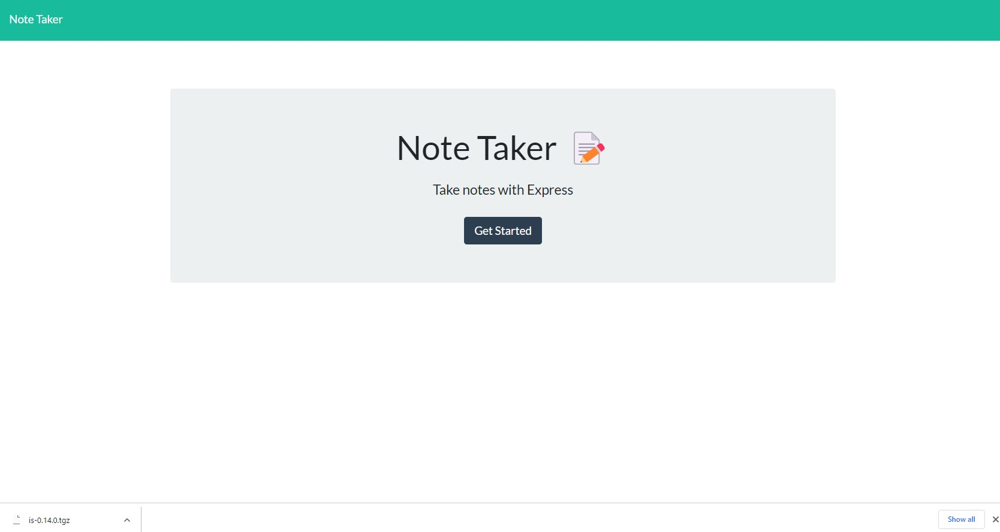
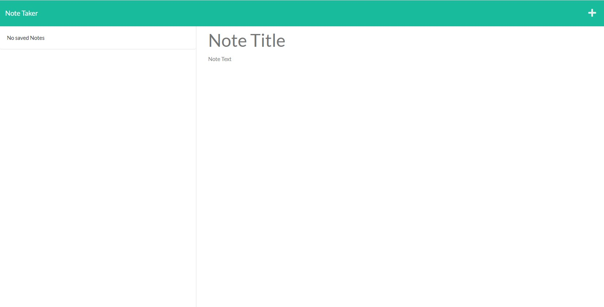
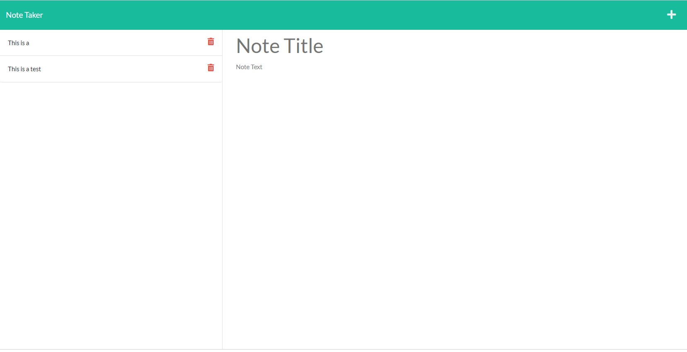

 # express-note-taker

  

  ## Description

  ### AS A small business owner I WANT to be able to write and save notes SO THAT I can organize my thoughts and keep track of tasks I need to complete

  ## Table of Contents

  * [Installation Instructions](#installation-instructions)
  * [Intended Use](#usage)
  * [Contribution](#contribution)
  * [Tests](#testing-instructions)
  * [Questions](#questions)
  * [License](#license)

  ## Installation Instructions

    npm install
### After this repository is cloned, the user should run the command 
    node server.js
### After the required dependencies are installed, enter this command to initialize the server they have to navigate at their local server

  ## Usage

  ### Anyone can use it if they want to save their notes 
  
  ## Contribution

### Blerand Ismaili

  
  ## Testing Instructions
  It will be tested on my personal server then showed by screenshots  
  ## Questions

   ## Screenshot
  - 
  - 
  - 

  
  ### GitHub profile: [BlerandIsm](https://github.com/BlerandIsm)

  
  ## License
  
  
  ### This project is licensed under the MIT open source license. Visit [Open Source Initiative](http://www.opensource.org/licenses/MIT) for the full license documentation.
  